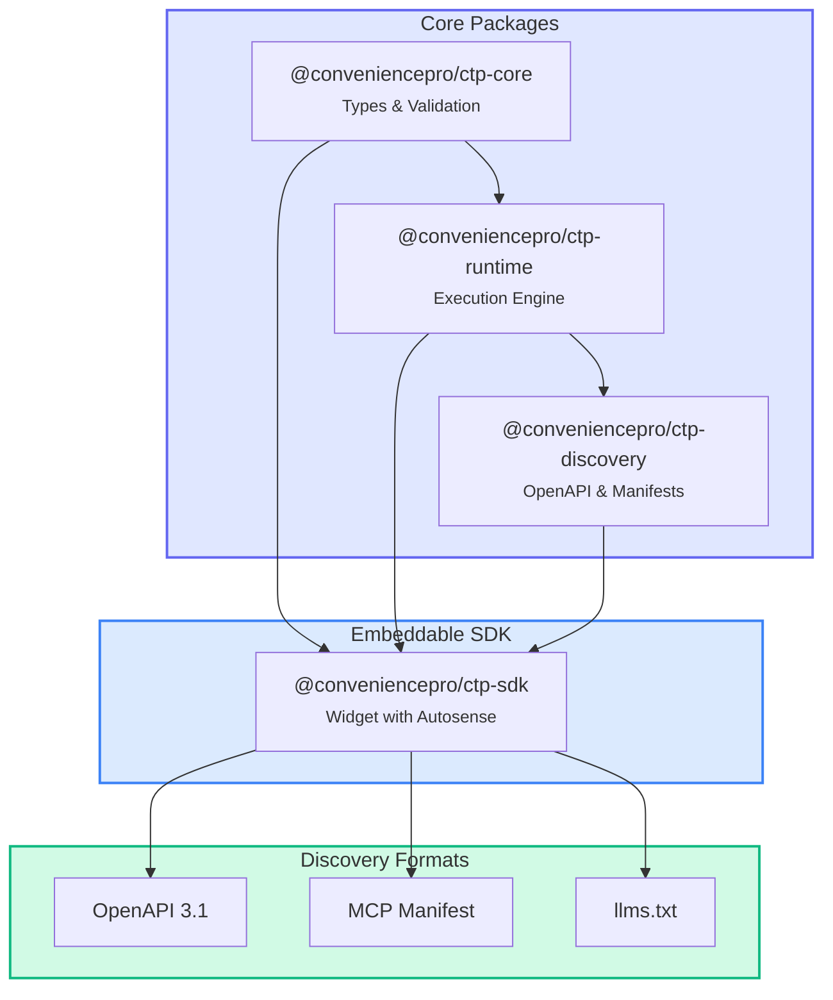

# ConveniencePro Tool Protocol (CTP)

**Version 1.0.0** | [GitHub](https://github.com/titan-alpha/ctp)

CTP is an open specification for building browser-native developer tools that are inherently compatible with the [Model Context Protocol (MCP)](https://modelcontextprotocol.io). It enables developers to create tools that work seamlessly in web browsers while maintaining full interoperability with AI-powered development environments.

## Why CTP?

<CardGroup cols={2}>
  <Card title="Browser-Native" icon="browser">
    Tools execute directly in the browser using Web APIs, ensuring privacy and eliminating server dependencies.
  </Card>
  <Card title="MCP Compatible" icon="plug">
    Automatic conversion to MCP format enables integration with Claude, Cursor, and other AI tools.
  </Card>
  <Card title="Type-Safe" icon="shield-check">
    Full TypeScript support with comprehensive schemas and validation.
  </Card>
  <Card title="LLM-Ready" icon="robot">
    Built-in AI hints and instructions help LLMs use your tools effectively.
  </Card>
</CardGroup>

## Quick Example

```typescript
import type { ToolDefinition, ToolFunction } from '@conveniencepro/ctp-core';

export const myToolDefinition: ToolDefinition = {
  id: 'hello-world',
  name: 'Hello World',
  description: 'A simple greeting tool',
  category: 'utilities',
  tags: ['hello', 'greeting', 'demo'],
  method: 'POST',
  parameters: [
    {
      name: 'name',
      type: 'text',
      label: 'Your Name',
      description: 'Name to greet',
      required: true,
    },
  ],
  outputDescription: 'Greeting message',
  example: {
    input: { name: 'World' },
    output: { message: 'Hello, World!' },
  },
  executionMode: 'client',
};

export const myToolFn: ToolFunction<{ message: string }> = (params) => {
  return {
    success: true,
    data: { message: `Hello, ${params.name}!` },
  };
};
```

## Architecture



## npm Packages

| Package | Description |
|---------|-------------|
| [`@conveniencepro/ctp-core`](https://npmjs.com/package/@conveniencepro/ctp-core) | Core types and validation |
| [`@conveniencepro/ctp-runtime`](https://npmjs.com/package/@conveniencepro/ctp-runtime) | Tool execution engine |
| [`@conveniencepro/ctp-discovery`](https://npmjs.com/package/@conveniencepro/ctp-discovery) | Discovery document generators |
| [`@conveniencepro/ctp-sdk`](https://npmjs.com/package/@conveniencepro/ctp-sdk) | Embeddable SDK |
| [`@conveniencepro/ctp-spec`](https://npmjs.com/package/@conveniencepro/ctp-spec) | Specification constants |

## Get Started

<CardGroup cols={2}>
  <Card title="Read the Specification" icon="book" href="/specification/overview">
    Understand the complete CTP protocol
  </Card>
  <Card title="Build Your First Tool" icon="hammer" href="/implementation/creating-tools">
    Step-by-step guide to creating tools
  </Card>
  <Card title="View Examples" icon="code" href="/examples/overview">
    Reference implementations
  </Card>
  <Card title="LLM Tool Generator" icon="robot" href="/llm-prompts/tool-generator">
    Have AI generate tools for you
  </Card>
</CardGroup>
